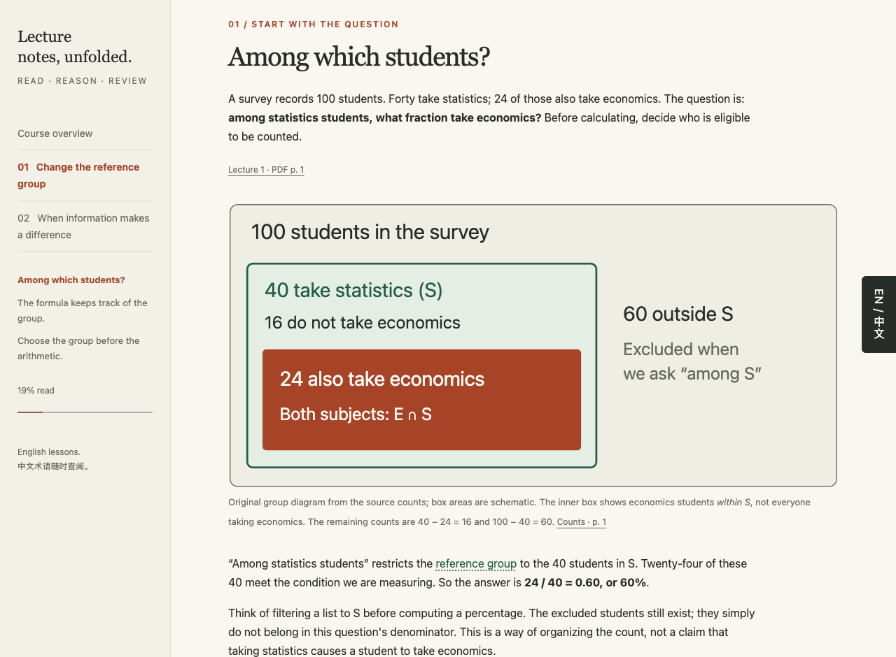
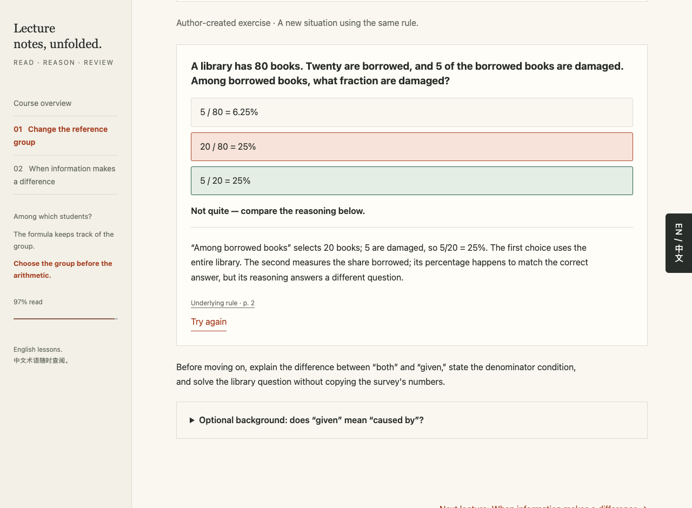
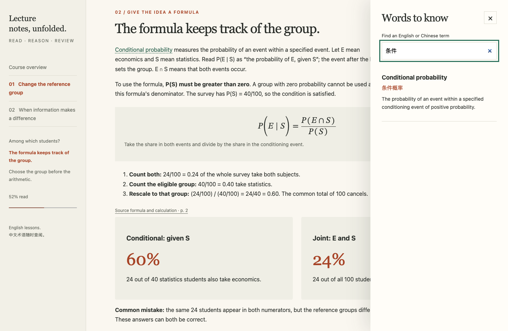

# Lecture to Course

### 把课件里的概念，讲到你能理解和运用。

将 lecture PDF 转化为**可以离线学习的课程网站**：用清楚的解释、图解、分步例题和带理由的测验，连接课堂上的知识点。

这是一个 **Codex 技能**。保留课程要求、关键假设和原始页码，由我们重新组织讲解，帮你从直觉走到公式，再自己做一道题。

[English](README.md) · [使用自己的课件](#使用自己的课件) · [体验自编示例](#体验自编示例) · [它怎样讲解](#它怎样讲解)



*截图来自仓库自带的概率论示例，材料由项目自行编写。默认英文讲解和测验，附可搜索的英中术语表。*


课程支持中英文讲解与练习。右上角的语言切换按钮随滚动保持可见，右侧“术语”入口独立保留；切换时保留作答状态和阅读位置，并记住语言选择。编写方法见[双语内容约定](lecture-to-course/references/authoring.md#bilingual-lessons)。

选择题可按错误选项提供针对性提示，重试时保留提示，也允许学生主动查看完整解析。切换语言时，提示与作答状态保持一致。编写方法见[测验提示约定](lecture-to-course/references/authoring.md#hints-before-the-full-answer)。

可选的概念复习面板将阅读进度与近期练习记录分开：区分独立答对、借助帮助答对、使用提示、答错和查看答案，并建议复习时间、链接到已编写的练习，包括后续课中的新情境变式。记录保留在浏览器中；复习间隔采用简单规则，不是掌握程度评分。编写方法见[概念复习约定](lecture-to-course/references/authoring.md#concept-evidence-and-cumulative-review)。

交互图解支持**先预测 → 再操作 → 解释原因**：先写下判断，再改变一个有意义的数量，最后解释结果。离线交集图解保持群体总人数不变，切换语言时保留笔记。编写方法见[交互图解约定](lecture-to-course/references/authoring.md#predict--operate--explain-diagrams)。

## 学习时能得到什么

| 你遇到的问题 | 课程提供的帮助 |
|---|---|
| “是不是某项基础知识没跟上？” | 可跳过的简短检查，答错后定位对应补充讲解，再返回原题。 |
| “这些知识点之间有什么关系？” | 用小问题组织核心小节，说明学习目标和前后承接；适合时用简短学习路线连接各步。 |
| “这个公式为什么成立？” | 将文字含义、具体数字与符号逐步对应，说明假设与近似。 |
| “例题看懂了，换一道还会吗？” | 从完整例题到补全步骤，再独立做题；支持输入数值或简短解释，并对照参考解答。 |
| “这个英文术语是什么意思？” | 在正文旁打开英中术语表，支持两种语言搜索。 |
| “老师在哪一页讲过？” | 直接链接回原始 PDF 的具体页码。 |
| “接下来该复习什么？” | 概念复习面板优先提示近期错误或依赖帮助的概念，建议复习日期，并在有其他题目时链接到另一道题。 |
| “之后怎么复习？” | 在本机反复打开课程，离线查看章节、公式和课件原件。 |

<details>
<summary><strong>看看测验反馈和中英术语表</strong></summary>

### 把答案和理由一起讲清楚

下面两个选项都等于 25%，但只有一个选对了题目要求的参照群体。反馈会解释另一个选项为什么不成立。



### 不离开课程，就能查术语



</details>

## 使用自己的课件

### 1. 在 Codex 中安装技能

把下面这段话发给 Codex：

```text
使用 $skill-installer 安装这个仓库里的 lecture-to-course 技能：
https://github.com/FriendlyPasser/lecture-to-course/tree/main/lecture-to-course
```

安装的是仓库内的 `lecture-to-course/` 子目录，包含脚本、模板和参考文档。

### 2. 提供 PDF，让它制作课程

附上课件，或提供本地路径。例如：

```text
使用 $lecture-to-course 处理 .local/my-lecture.pdf。
制作一个离线课程，用直观解释、图解、分步例题和自检讲清概念。
保留重要推导、适用条件和原始页码引用。
```

Codex 会阅读并核对原始页面，梳理概念，编写讲解，再构建和检查网站。你可以提供一份课件，也可以按授课顺序提供多份。

**制作课程需要：**Codex、Python 3.10 或更新版本、`pypdf`，以及用于页面渲染的 Poppler。完整的依赖安装和手动流程见[课程编写指南](docs/AUTHORING.md)。课程生成后，阅读时不需要 AI 服务、API 密钥或网络连接。

## 体验自编示例

直接构建仓库中已经编写好的两节概率论课程。**只需 Python 3.10 或更新版本，无需 Codex 或 Poppler。**

macOS/Linux：

```bash
git clone https://github.com/FriendlyPasser/lecture-to-course.git
cd lecture-to-course
python3 -m venv .local/venv
source .local/venv/bin/activate
python -m pip install --cache-dir .local/cache/pip -r requirements.txt
python -B lecture-to-course/scripts/build_course.py demo/course.json --out .local/demo/site
python -B .local/demo/site/launch_course.py
```

最后一条命令会用默认浏览器打开课程。学习期间保持终端窗口开启，按 `Ctrl+C` 停止本机服务。

<details>
<summary><strong>Windows 操作与其他打开方式</strong></summary>

Windows 创建虚拟环境时，可用 `python` 或 `py` 代替 `python3`。将激活虚拟环境的命令替换为：

- **PowerShell：** `.\.local\venv\Scripts\Activate.ps1`
- **CMD：** `.local\venv\Scripts\activate.bat`

激活后继续执行剩余的安装、构建和启动命令。

也可以直接打开 `.local/demo/site/index.html`。如果受到浏览器本地文件权限限制，请使用启动器。macOS 用户可双击生成目录中的 `打开课程.command`。启动器需要 Python 3，仅在本机提供课程。

如需选择浏览器，可让启动器只打印本机地址：

```bash
python -B .local/demo/site/launch_course.py --no-browser
```

将终端打印的完整地址复制到所需浏览器。学习期间保持终端开启。每次启动可能使用不同端口，请使用当次打印的地址。

</details>

已经构建过示例时，用最后一条命令重新打开即可。重新构建请使用新的输出目录，例如 `.local/work/demo-v2`；构建器不会覆盖已有的非空目录。

## 它怎样讲解

**Lecture 确定要学什么，课程把中间的推理讲清楚。**

概率论示例可先检查分数与交集，也可直接跳到 **100 名学生 → 40 名统计课学生 → 其中 24 名也学经济学**。同一份调查逐步提出新问题：怎样把群体限制写成公式？知道学生选了某门课，会不会改变另一门课的概率？每个新概念回答前一步留下的问题，再用图书馆情境检查能否迁移这些推理；后续课中的新诊所题则让学生重新提取先前选择分母的方法。

技能采用以下原则：

1. **先梳理概念与前置知识。** 保留 lecture 边界和来源覆盖；对必要基础做简短检查，提供可选的定向补充，并允许直接跳过。
2. **用相连的问题带出概念。** 对适合的相关概念采用贯穿案例，让下一个知识点解决前一步留下的问题；保留核心推导、必要条件和教师关键例题。
3. **练习后能追溯来源。** 从完整例题到补全步骤，再独立完成变式，逐步减少帮助；让学生输入数值或解释推理，提供参考解答与重试。保留来源链接，明确标注自编例子和额外背景。
4. **回到先前的概念。** 在后续课编写改变情境的题目，将阅读、提示、作答和自评分别记录，建议间隔复习，不将记录称为已掌握。

课程结构随内容调整，不强制固定章节数量，也不要求每个概念都配动画。

## 使用前了解这些

- **面向正在上这门课的学生。** 保留重要推导、假设和例题，采用桌面阅读布局。
- **AI 编写，需要核对来源。** 脚本负责提取、构建和检查，Codex 在阅读页面后编写讲解；生成流程需要内容审核。
- **原始材料质量影响结果。** 扫描件、模糊公式需要视觉核对，不清楚的部分会被标注，不会靠猜测编成测验。
- **生成后可以离线阅读。** 输出使用本地 HTML、CSS、JavaScript 和浏览器原生 MathML，无需后端或在线公式渲染服务。

详细标准与已有验证见[教学要求](lecture-to-course/references/teaching.md)和[验证记录](VALIDATION.md)。阅读进度只表示读到了哪里，不代表已经掌握。复习记录仅保存在当前浏览器与来源地址下；存储不可用时，当前页面仍可临时记录。本地文件的存储行为因浏览器而异，启动器端口变化也可能产生独立记录。无需账号，不向服务器同步。

## 进一步了解与参与

- [课程编写指南](docs/AUTHORING.md)：依赖安装、PDF 核对、内容格式和构建命令。
- [开发指南](docs/DEVELOPMENT.md)：项目结构、测试与截图复现。
- [自编示例源文件](demo/course.json)：查看课件、讲解和术语表如何组织。
- [反馈问题](https://github.com/FriendlyPasser/lecture-to-course/issues)：指出哪里仍然难懂、图示不清楚或测验不合理，并附上你有权分享的最小示例。

欢迎贡献更清楚的例题、更有针对性的误区题、无障碍改进，以及可以复现的 PDF 处理修复。

**想在下一份 lecture 上试试？可以 Star 收藏这个仓库。**

## 致谢

受到 [zarazhangrui/codebase-to-course](https://github.com/zarazhangrui/codebase-to-course) 启发。本项目采用独立编写的桌面模板和面向 lecture PDF 的教学流程。
